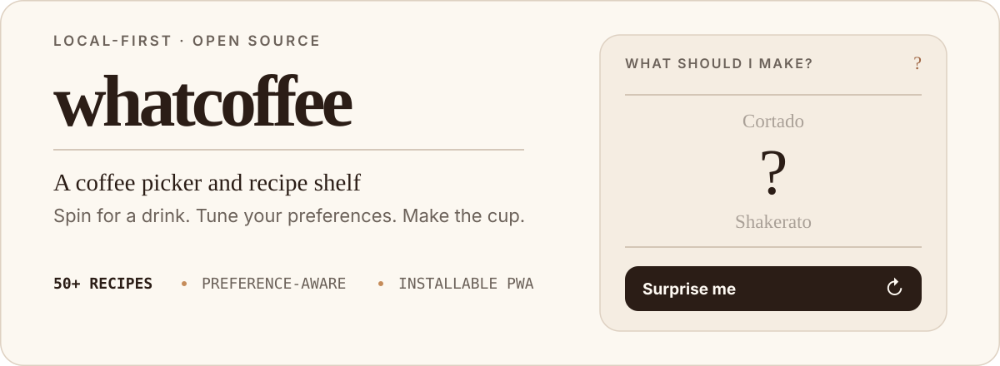

<p align="center">
  
</p>

<p align="center">
  <strong>Stop deciding. Start brewing.</strong><br>
  Spin for a coffee, refine the result with a few preferences, then follow a concise recipe without wading through a recipe blog.
</p>

<p align="center">
  <a href="#run-locally">Run locally</a> ·
  <a href="#how-it-works">How it works</a> ·
  <a href="#contributing">Contribute</a>
</p>

## How it works

1. **Spin** — let the coffee reel choose from 50+ drinks.
2. **Refine** — optionally tune temperature, milk, perceived strength, and sweetness.
3. **Make** — open a focused recipe with measured ingredients, preparation steps, origin, and serving notes.

The picker starts with an unanswered `?`, so the first visit never looks like it has already chosen for you. Results remain local to the browser, preferences are saved on the device, and reduced-motion settings are respected.

## What is inside

- A paced surprise-me reel with preference-aware recommendations
- 50+ coffee and tea-latte recipes, searchable by name and filterable by serving style
- Dedicated recipe pages with ingredients, proportions, method, origin, and flavour profile
- Responsive desktop and mobile layouts with light, dark, and system themes
- An installable PWA manifest and service worker for shell and page caching
- Recipe suggestions submitted to GitHub for review when the server-side integration is configured
- Canonical URLs, recipe structured data, an XML sitemap, and AI-readable recipe indexes
- No account requirement or analytics

## Run locally

You need Node.js 20 or newer and pnpm 11 or newer.

```bash
git clone https://github.com/akkitheakhil/whatcoffee.git
cd whatcoffee
pnpm install
pnpm dev
```

Open [http://localhost:3000](http://localhost:3000).

For a production build:

```bash
pnpm build
pnpm start
```

## Built with

- [Next.js](https://nextjs.org/) App Router
- React and TypeScript
- Tailwind CSS v4 with shared CSS design tokens
- `next-themes` for theme switching
- Zod for coffee catalogue validation
- pnpm for package management

## Configuration

The app works without environment variables. Configuration is only required for GitHub recipe submissions, a custom production domain, or Google ownership verification.

Copy `.env.example` to `.env.local`, then add only the values you need:

```env
SITE_URL=
GOOGLE_SITE_VERIFICATION=
GITHUB_TOKEN=
GITHUB_REPOSITORY=akkitheakhil/whatcoffee
```

<details>
<summary><strong>GitHub recipe suggestions</strong></summary>

The suggestion form creates an issue in [`akkitheakhil/whatcoffee`](https://github.com/akkitheakhil/whatcoffee) through a server-side route. The GitHub token is never sent to the browser.

Create a fine-grained GitHub personal access token with **Issues: Read and write** permission for this repository, then set `GITHUB_TOKEN`. `GITHUB_REPOSITORY` already defaults to `akkitheakhil/whatcoffee`. Without a token, the form displays an unavailable state and sends nothing.

</details>

<details>
<summary><strong>Search and sharing</strong></summary>

WhatCoffee generates canonical URLs, an XML sitemap, social-sharing images, recipe structured data, `/llms.txt`, and `/llms-full.txt`.

Vercel deployments use `VERCEL_PROJECT_PRODUCTION_URL` automatically. Set `SITE_URL` when a custom domain should be canonical:

```env
SITE_URL=https://your-domain.example
```

After deployment:

1. Add the production site to [Google Search Console](https://search.google.com/search-console/about).
2. If you use HTML-tag verification, set `GOOGLE_SITE_VERIFICATION` to the value from the tag and redeploy.
3. Submit `https://your-domain.example/sitemap.xml` through Search Console and Bing Webmaster Tools.
4. Check several drink pages with Google's [Rich Results Test](https://search.google.com/test/rich-results).

</details>

## Project map

```text
app/                       Pages, routes, metadata, manifest, sitemap, and shared CSS
components/                Interactive experiences and reusable UI
lib/coffees.ts             Validated coffee catalogue and recipe data
lib/seo.ts                 Metadata and structured-data helpers
public/sw.js               PWA service worker
.github/                   CI, issue forms, and pull-request template
```

Coffee content lives in [`lib/coffees.ts`](lib/coffees.ts). Shared light and dark design tokens live at the top of [`app/globals.css`](app/globals.css).

## Quality checks

```bash
pnpm typecheck
pnpm lint
pnpm build
```

GitHub Actions runs the same checks on pushes and pull requests targeting `master`.

## Contributing

Coffee knowledge, recipe corrections, code, design, accessibility improvements, and documentation are all welcome.

1. Check the existing issues or open a structured [bug report](https://github.com/akkitheakhil/whatcoffee/issues/new?template=01-bug.yml), [recipe proposal](https://github.com/akkitheakhil/whatcoffee/issues/new?template=02-recipe.yml), or [feature request](https://github.com/akkitheakhil/whatcoffee/issues/new?template=03-feature.yml).
2. Fork the repository and create a focused branch.
3. Make the change and run the quality checks above.
4. Open a pull request against `master` and explain what changed, why it is needed, and how it was tested.

For recipes and factual corrections, include reliable sources and verify the drink name, origin, serving temperature, ingredients, proportions, and preparation steps. Preserve the existing keyboard, responsive, theme, and reduced-motion behaviour when changing the interface.

## License

WhatCoffee is available under the [MIT License](LICENSE).
